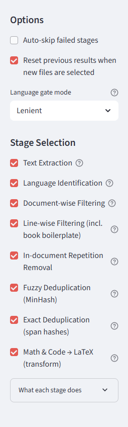
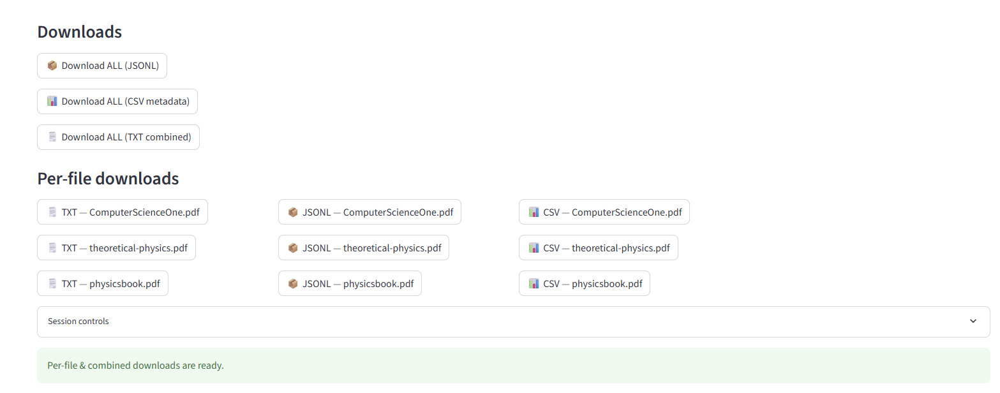

# MDR 7-Stage Cleaner (Local PDFs/DOCX/TXT)

Streamlit app to convert messy PDFs/DOCX/TXT into **RAG‑ready** text. It supports **per‑page OCR**, **boilerplate cleanup**, **math/code → LaTeX**, and **fuzzy/exact dedup**, with **per‑file** and **combined** downloads.

> No auto‑processing on upload — click **Process files now** when you’re ready.  
> Results persist across reruns — downloading won’t clear your outputs.  
> Modes: **General** (stricter) and **Academic** (preserve math/code).

---


### 1) Sidebar options (before processing)
This is always visible on the left. Choose **Document mode**, **Language gate**, and which **stages** to run.  
- *Academic* relaxes filters and preserves math/code; *General* is stricter.
- Toggle “Reset previous results when new files are selected” if you want a fresh session when you change uploads.



---

### 2) Home screen — before selecting files
You’ll see the uploader and a disabled **Process files now** button until you add files.


---

### 3) Home screen — after selecting files (ready to run)
Once you add PDFs/DOCX/TXT, the **Process files now** button becomes active. Click it to run the 7‑stage pipeline.


---

### 4) Results & downloads
After processing finishes, scroll to **Downloads**. You can export:
- **ALL** files together (JSONL / CSV metadata / TXT combined / DOCX combined)
- **Per‑file** TXT / JSONL / CSV / DOCX

Outputs persist until you change the uploaded file set (or press **Clear results**).



> Tip: If you ever see “Stage 6 removed text: fuzzy duplicate…”, that’s dedup working. Re‑running on the same files can detect near‑duplicates across runs unless configured otherwise.

---

## ✨ Features

- **8‑stage pipeline**
  1) Text extraction (PDF/DOCX/TXT) with **auto per‑page OCR**
  2) **Language identification** (fastText; math/code‑aware)
  3) **Document‑wise filters** (length, symbol ratio)
  4) **Line‑wise cleanup** (headers/footers, boilerplate) — mode‑aware
  5) **In‑document repetition removal**
  6) **Fuzzy dedup** across files (MinHash LSH)
  7) **Exact span dedup** across files
  8) **Math & code → LaTeX** (inline + fenced blocks)
- **Scanned‑PDF detection** with one‑click **Full‑document OCR**
- **Tables** (Camelot) and **Figure OCR snippets** included in JSONL
- **Persistent session** — downloads don’t wipe results

---

##  Install

### Prerequisites
- Python 3.9+ (3.10 recommended)
- **Tesseract OCR** installed  
  - Windows default: `C:\Program Files\Tesseract-OCR\tesseract.exe`  
  - Or set env var `TESSERACT_CMD` to the path.
- **fastText** `lid.176.bin` stored **outside** the repo  
  - Set `FASTTEXT_LID_PATH` to its location.

### Python packages
```bash
python -m venv .venv
# Windows
.venv\Scripts\activate
# macOS/Linux
source .venv/bin/activate

pip install --upgrade pip
pip install streamlit pymupdf docx2txt pytesseract pillow datasketch fasttext pandas
# Optional
pip install python-docx camelot-py[cv]
```

> **GitHub size note:** Don’t commit `lid.176.bin` (~125MB). Keep it outside Git and set `FASTTEXT_LID_PATH`.
> If it was added earlier, remove it from history (filter‑repo/BFG) and force‑push.

---

##  Run

```bash
# Windows (PowerShell)
$env:TESSERACT_CMD="C:\Program Files\Tesseract-OCR\tesseract.exe"
$env:FASTTEXT_LID_PATH="C:\models\lid.176.bin"

# macOS/Linux
export TESSERACT_CMD="/usr/local/bin/tesseract"
export FASTTEXT_LID_PATH="/path/to/lid.176.bin"

streamlit run mdr_streamlit_app.py
```

Open http://localhost:8501.

---

##  Workflow

1. **Upload** PDFs/DOCX/TXT.  
2. Pick **Document mode** and **Language gate**.  
3. Select/deselect **Stages**.  
4. Click **▶️ Process files now**.  
5. **Download** your outputs (ALL or per‑file).

---

## 📦 Output Formats

### JSONL (records)
- text chunks (post‑cleaning; LaTeX if Stage 8),  
- tables (`table_markdown`),  
- figure OCR snippets (`figure_text`).

### CSV (metadata)
Per‑file summary: filename, word_count, number of chunks/tables/figures, processed_at.

### TXT / DOCX
- Combined ALL files or per‑file documents.
- DOCX includes sections for text, tables (Markdown), and figure OCR snippets.

---

##  Troubleshooting

- **“fuzzy duplicate” warnings** — dedup worked; try disabling dedup stages or change files.  
- **Tesseract not found** — install it and set `TESSERACT_CMD`.  


---


